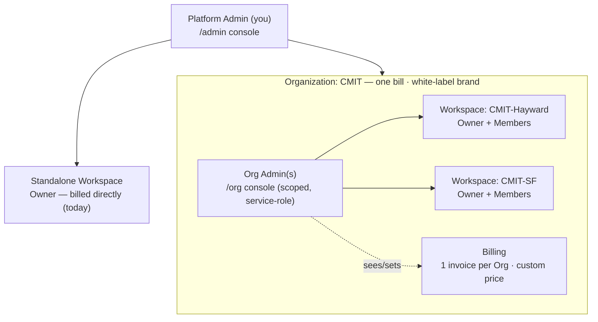

# UltraQuote — Organizations / White-Label Hierarchy Design

> Design doc (2026-06-25). Adds a layer **above** today's Workspace so UltraQuote can be white-labeled /
> resold to MSP brands (CMIT, TeamLogic, …) and other CPQ-style businesses. A new **Organization** groups
> multiple **Workspaces** (each run by an **Owner**) under one billing + brand umbrella, managed by an
> **Org Admin** (the role you called "Tenant Admin"). No code yet — feasibility verdict, data model,
> permissions, billing, risks, phasing. **See §1 for canonical nomenclature** (Workspace = the `tenants`
> table; Owner = the person who runs it).

---

## 0. Feasibility verdict (you asked: is this possible + major challenges?)
**Yes, and it's additive — not a rewrite.** Three things in the current design make it tractable:
1. **Tenants are already cleanly isolated** (a hard `tenant_id` boundary + RLS helpers). Grouping tenants
   under a parent is a **nullable `organization_id`** + new tables — existing tenants are simply
   "standalone" (no org). Fully backward-compatible.
2. **You already have the exact pattern** for "an admin who reads across many tenants": the **Platform
   Admin `/admin` console uses the service-role client filtered server-side** (`platform_admins`, no
   client RLS). The Org Admin console is **the same pattern, scoped to one `organization_id`** — so it
   needs **little-to-no RLS rewrite** (the big risk-avoider).
3. **Subscription/access is already modular** (the `getAccessState` resolver). Adding an org tier is
   AND-ing one more condition, not redesigning the gate.

**Biggest challenges (called out honestly, detail in §9):**
- The **"one user → one tenant"** assumption is baked into auth/RLS. An Org Admin spans *many* tenants →
  model them as a **new org-level principal** (like `platform_admins`), **not** as a tenant user.
- **Billing moves up a level** (bill the org for aggregated usage). Stripe billing isn't built yet — this
  is good timing to design it **org-aware from day one** rather than retrofit per-tenant billing.
- **True white-label** (custom domain per brand, remove "UltraQuote" branding, per-brand emails) is the
  **heaviest** piece and a separate later phase — the role hierarchy is just its prerequisite.
- **Terminology:** "Tenant Admin" is ambiguous (sounds like an admin *of* a tenant = the Owner). Use
  **Organization / Org Admin** to avoid renaming the existing `tenants` table.

---

## 1. Nomenclature (canonical — use these terms going forward)
The product/UI and this doc use the terms in the **Term** column. The DB keeps its existing names (we do
**not** rename the `tenants` table — that would be huge, risky churn); the **DB** column shows the
internal name. **"Tenant" is the internal/DB name for a Workspace** — prefer **Workspace** everywhere
user-facing.

| Term (canonical) | What it IS | DB | Cardinality | Your earlier word |
|---|---|---|---|---|
| **Platform Admin** | You — runs the whole platform | `platform_admins` | global | Platform Admin |
| **Organization** ("Org") | An MSP **brand / reseller** — the billing + white-label umbrella | `organizations` *(new)* | many | your "Tenant" (the brand) |
| **Org Admin** | A **person** who administers an Organization (new role) | `organization_admins` *(new)* | 1..n per Org | **"Tenant Admin"** |
| **Workspace** | One MSP **account/office** — the data container (subscription, products, clients, quotes, branding) | `tenants` (+ `organization_id`) | many per Org, or standalone | "Owner's workspace" |
| **Owner** | The **person** who heads a Workspace | `users.role='owner'` | exactly 1 per Workspace | Owner |
| **Member** | A **teammate** in a Workspace | `users.role='member'` | 0..n per Workspace | Teammate |

**Entity vs person (important):** a **Workspace** is the *account*; an **Owner** is the *person* who runs
it — they map **1:1** but are different kinds of thing. "Add an Owner" really means **create a Workspace +
invite its Owner**. "Org Admin manages Owners" means **manages the Workspaces, each fronted by an Owner.**

So the hierarchy is **4 levels**: Platform Admin → Org Admin → Owner → Member. A **standalone Workspace**
(`organization_id = NULL`) belongs to no Organization and behaves exactly as today (your direct customers).

```
Platform Admin (you)
├── Organization "CMIT"              ← billing + brand umbrella
│   ├── Org Admins (1..n)            ← manage Workspaces, subscriptions, pricing; see activity
│   ├── Workspace: CMIT-Hayward      → Owner + Members
│   └── Workspace: CMIT-SF           → Owner + Members
├── Organization "TeamLogic" …
└── Standalone Workspace (direct customer, organization_id = NULL)  ← today's model, unchanged
```

---

## 1b. Architecture diagram

*(More Organizations — TeamLogic, … — each its own bill + brand. Standalone Workspaces
(`organization_id = NULL`) are today's direct customers, unchanged.)*

## 2. Data model
**New `organizations`:** `id`, `name`, `slug`, billing fields (`subscription_term`, `subscription_end`,
`platform_enabled`, custom pricing/discount — see §5), branding (`logo_url`, `accent`, `custom_domain`,
`white_label` bool), `deletion_scheduled_at` (reuse the tenant-deletion pattern), timestamps.

**New `organization_admins`:** `org_id`, `user_id`, `created_at` — RLS enabled, **no client policies**
(service-role only), exactly like `platform_admins`. An Org Admin is its own principal; **not** a row in
`users` tied to a tenant. (Decision §9.4: keep Org Admin strictly org-level at first — simplest.)

**`tenants.organization_id`** — nullable FK to `organizations`. NULL = standalone (today). Set = belongs
to that org. This single column is what threads the hierarchy through everything.

**Auth:** an Org Admin is a Supabase Auth user whose membership lives in `organization_admins`. On login,
resolve principal type: platform admin? org admin? tenant user? → route to the right console. (Mirrors
how `getPlatformAdminUser()` already works.)

---

## 3. How the Org Admin operates — a scoped console (the key, low-risk move)
The Org Admin gets an **`/org` console** that is the Platform Admin `/admin` console **scoped to their
`organization_id`** — built the same way: **service-role queries filtered by `organization_id`**, guarded
by an `getOrgAdminUser()` check. This deliberately **avoids cross-tenant RLS rewrites** (the riskiest
part). They manage their org from here; they do **not** operate "inside" a single tenant's app.

Console surfaces (mirrors `/admin` + the new dossier work):
- **Owners/workspaces list** — name, owner, user count, quote count, subscription status, last activity.
- **Add / invite a Workspace** (creates a Workspace under the org + invites its Owner). **Disable /
  delete** a Workspace (reuse the Workspace-deletion + dossier we just built — scoped to their org).
- **Subscription & pricing** per workspace (within limits the Platform Admin sets for the org).
- **Activity / reporting** — rollups: # owners, # users, subscription statuses, **quote status counts &
  values** across all their workspaces (this is the dossier/dashboard data, aggregated at org level).

---

## 4. Permissions & visibility (the open question — recommendation)
You're undecided whether the Org Admin sees **quote content + product pricing/cost**. Here's the tension
and my recommendation:
- **For oversight/billing/QA**, the Org Admin legitimately needs **metadata + rollups**: owner/user
  details, subscription status, **quote counts/statuses/values**, activity. ✅ Always allow this.
- **Quote line-item detail + product cost/margin is the workspace's confidential business data.** A CMIT
  location may not want corporate seeing its client quotes or its margins. So **don't expose it by
  default.**

**Recommendation — a per-org "Org Admin visibility" setting with two tiers:**
1. **Oversight (default):** counts, statuses, $ totals, activity — **no** line items, **no** cost/margin.
2. **Full:** read-only access to quote documents + the catalog (cost/price). Appropriate for **franchise /
   white-label** orgs where corporate standardizes pricing and wants full insight.

Make it explicit and per-org (and ideally disclosed to Owners) so it's a deliberate trust decision, not a
silent backdoor. This also future-proofs an **org-managed shared catalog** (corporate sets a standard
product catalog inherited by all workspaces — a powerful white-label feature; see §9.5 / parked).

> Note on "manage pricing for their Owners": this is ambiguous — it could mean (a) the **subscription
> plan/seats** the org assigns each workspace (billing), or (b) a **shared product catalog/pricing** the
> org pushes down to workspaces (white-label franchise). They're different features — (a) is in scope
> here; (b) is a bigger "org-managed catalog" feature, parked in §9.5.

---

## 5. Billing — bill the Org, custom price per Org
You want **different subscription charges per Org** and to **bill the Org for all activity under it.**
- **Subscription + billing move to the organization level.** An org has its own subscription window +
  **custom pricing** (per-org base price + discount). The frozen per-tenant pricing model already supports
  admin-editable prices + per-tenant discounts (see `docs/pricing-model-design.md` §5a) — **extend the
  same mechanism to the org level**: Platform Admin sets each org's negotiated pricing.
- **Usage rolls up:** metering (completed documents, seats) **aggregates across all the org's Workspaces**
  → **one Stripe customer + one invoice per org.** Standalone Workspaces keep their own billing (today's model).
- **Stripe timing is a gift:** billing isn't built yet, so design the metering/Stripe layer **org-aware
  from the start** — a `billing_account` that is *either* a Workspace (standalone) *or* an Organization. No
  retrofit. This should be folded into **Stripe Phase 0** (the next big build).
- The Org Admin can **see** their consolidated usage/bill; the Platform Admin sets the org's price/plan.
  Whether Org Admins set *per-workspace* sub-limits within their plan is a §9 decision.

---

## 6. Access lifecycle (extends the existing resolver)
A **Workspace's** effective access becomes the **AND of three levels**:
`org_enabled AND org_subscription_ok` **∧** `workspace_enabled AND workspace_subscription_ok` **∧** `user_enabled`.
- Concretely: extend `getAccessState` so that if `tenant.organization_id` is set, it first checks the
  **org** status (suspended/expired) — suspending or letting an **org** lapse gates **all** its workspaces
  at once (one kill switch for the brand). Standalone Workspaces (no org) behave exactly as today.
- Reuse the existing grace/expired/suspended machinery (migration 012) — just add the org as a
  higher-precedence gate. Low, well-contained change.
- **Deletion:** deleting an **org** should schedule/cascade-delete its tenants (reuse the tenant-deletion
  flow we built — migration 018 + purge). One more level for the purge to walk.

---

## 7. Onboarding / invite chain
A 3-step invite chain, each reusing the existing invite mechanics (`lib/invites.ts`):
1. **Platform Admin → Org Admin:** create the `organization` (+ pricing/branding) and invite the first
   Org Admin (like inviting a Workspace Owner today, but at org level).
2. **Org Admin → Owner:** create a Workspace under the org and invite its Owner.
3. **Owner → Member:** unchanged (today's Settings → Team).

---

## 8. White-label scope (tiered — don't bite it all at once)
"White-label" is a spectrum; sequence it:
- **Tier 1 — light branding (cheap):** org logo + accent applied to all its workspaces; "for <Org>" in
  the app chrome. Mostly reuses existing Workspace branding/accent, lifted to org level.
- **Tier 2 — domain + de-branding (heavy):** a **custom domain per org** (e.g. `quotes.cmit.com`),
  per-host org resolution, remove/replace "UltraQuote" branding, and **per-brand transactional email**
  (invites/quotes sent from the org's domain — interacts with the Zoho/SMTP setup). This is the big lift:
  wildcard TLS + per-host routing on Netlify, theming, and email-sender identity per org. **Separate phase.**
- Note: prior memory said white-label is **not built and shouldn't be promised** — this design is the
  foundation; full Tier 2 white-label remains a substantial later effort.

---

## 9. Major challenges & risks (the honest list)
1. **"One user → one tenant" assumption.** Mitigation: Org Admin is a separate principal
   (`organization_admins`, service-role console), never a tenant user. Keeps the existing model intact.
2. **Cross-tenant visibility.** Mitigation: do it in a **service-role org console** (like `/admin`), not
   via new RLS policies, to avoid RLS churn/risk. (If you later want org admins to use the *normal* app UI
   across workspaces, that's real RLS work — avoid for v1.)
3. **Billing middle layer + Stripe.** The per-tenant pricing model needs an **org variant** (billing
   account = tenant *or* org; metering rolls up). Best handled by designing Stripe Phase 0 org-aware now.
4. **Org Admin identity.** Decide: can an Org Admin **also** be an Owner of a workspace (dual hat)?
   Recommend **no** initially (strictly org-level, like platform admins) — simpler auth/routing.
5. **Org-managed shared catalog** (corporate pushes standard products/pricing to workspaces) — powerful
   for franchises but a meaningful feature (inheritance, overrides, sync). **Parked.**
6. **Custom domains / de-branding** (Tier 2) — the heaviest technical piece (TLS, routing, email identity).
7. **Lifecycle/deletion** now has an org dimension — extend the access resolver + the tenant-deletion
   purge to walk org → Workspaces.
8. **Terminology churn** — introduce "Organization/Org Admin"; do **not** rename the existing `tenants`.
9. **Reporting volume** — org rollups across many workspaces' quotes/usage; fine at MSP scale, but design
   the queries to aggregate server-side (service role), not per-row in the browser.

**Net:** the *role + hierarchy + org console + org billing* is a **medium** build that fits the existing
patterns. **Full white-label (Tier 2 domains/de-branding)** is the part that's genuinely large — keep it
a separate, later phase.

---

## 10. Suggested phasing
- **Phase 1 — hierarchy foundation:** `organizations` + `organization_admins` + `tenants.organization_id`
  (migration). `getOrgAdminUser()` guard. `/org` console (read-only first): list workspaces + rollups
  (owners/users/subscriptions/quote-status counts & values). Standalone Workspaces unaffected.
- **Phase 2 — org management:** Org Admin invites Owners / creates workspaces; disable/delete workspace
  (reuse dossier + deletion); per-workspace subscription within org limits. Platform Admin invites Org
  Admins + sets org pricing.
- **Phase 3 — org billing (with Stripe Phase 0):** billing account = org; usage rollup; one invoice/org;
  per-org custom price. Org access gate (§6).
- **Phase 4 — visibility controls:** the Oversight/Full toggle (§4); optional org-managed catalog.
- **Phase 5 — white-label Tier 2:** custom domains, de-branding, per-brand email.

---

## 11. Rollout & operations for existing users (migration runbook)
This change is **additive and backward-compatible** — existing logins, roles, and data are untouched.

### 11.1 Identity model — answering "Platform Admin + Owner = one entity?"
One **auth login** can hold **multiple memberships**, each in its own table; that's already how Prod works
and it doesn't change:
- `platform_admins` → **Platform Admin** hat
- `organization_admins` → **Org Admin** hat (NEW, optional)
- `users` (tenant_id + role) → **Owner / Member** hat

So `sameer@cmithayward.com` today is **Platform Admin (`platform_admins`) + Owner of CMIT-Hayward
(`users`)** — two hats on one login. After this change he simply *can* also gain an **Org Admin** hat.
Nothing is forced to split. (Whether you *prefer* separate logins per hat is a policy choice — see 11.4.)

### 11.2 Migration day (zero-downtime)
1. Back up (Supabase export / Pro daily backups).
2. Apply migration: `organizations` + `organization_admins` + **`tenants.organization_id` (nullable)**.
3. **Every existing Workspace defaults to `organization_id = NULL` → "standalone"** = exactly today's
   behavior (same access gate, same per-Workspace billing). No customer notices anything.
4. Verify: Sameer still Platform Admin + Owner; CMIT-Hayward / Pandya's / etc. all standalone; login + the
   access gate behave as before (the new org-level gate only applies once `organization_id` is set).
5. Org features (`/org` console, Org Admin invites) ship behind Phase 1+ — **no existing user is placed
   under an Org without an explicit action.**

### 11.3 Converting an existing brand into an Organization (when you choose to)
A data **re-parenting, not a re-onboarding** — the Workspace keeps its owner, members, products, quotes:
1. Platform Admin creates the **Organization** (name, pricing, branding).
2. Set that Workspace's `organization_id` (e.g. CMIT-Hayward → CMIT); repeat for sibling Workspaces.
3. Invite the **Org Admin(s)**.
4. **Billing transition:** move the Workspace's subscription up to the Org (consolidated invoice). Until
   Stripe billing exists this is config; once built, the Org becomes the `billing_account`.
5. **Notify the Owner(s)** their Workspace now sits under an Org, and what the Org Admin can see
   (the Oversight-vs-Full visibility tier, §4) — a trust disclosure.
6. **Reversible:** unset `organization_id` → back to standalone.

### 11.4 Sameer specifically (the dual/triple-hat account)
- **Option A — leave as-is (recommended first):** CMIT-Hayward stays **standalone**; Sameer stays
  Platform Admin + Owner. Use it as the reference/test Workspace. Zero change.
- **Option B — dogfood the Org flow:** create Organization "CMIT", move CMIT-Hayward under it, and let
  Sameer also be its **Org Admin** → one login holding **Platform Admin + Org Admin + Owner**. The cleanest
  way to exercise the new flows end-to-end. (Deliberate exception to the §9.4 "Org Admin shouldn't also be
  an Owner" guidance — fine for your own dogfooding.)

### 11.5 UI implication — a console / hat switcher
Because one login can wear several hats, the app must let it **choose context.** Today the sidebar shows a
"Platform Admin" link when `platform_admins` matches; extend principal resolution to also offer an
**Organization (`/org`) link** when `organization_admins` matches, alongside the normal Workspace app when
they're a Workspace user. A small **Platform / Organization / Workspace** switcher covers multi-hat logins.

### 11.6 Guarantees / risks
- **Backward-compat is gated on `organization_id IS NULL`** = today's path → safe + reversible.
- **Never auto-assign** existing Workspaces to an Org — don't surprise customers with a new admin above them.
- Existing per-Workspace subscriptions persist until a Workspace is explicitly moved under an Org.

## 12. Parked decisions (Owner to weigh in)
- **Quote/pricing visibility for Org Admins** — default **Oversight** (no line items/cost), with an opt-in
  **Full** tier? (My recommendation; confirm.)
- **"Manage pricing"** = subscription/seats per workspace (in scope) vs **org-managed shared catalog**
  (bigger feature, parked)?
- **Can an Org Admin also own a workspace** (dual role)? (Recommend no for v1.)
- **Do Org Admins set per-workspace sub-limits** within their org plan, or is everything pooled at org level?
- Compatibility confirmed: existing tenants become **standalone** (organization_id NULL) — zero migration risk.
